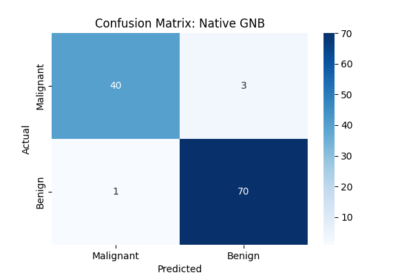
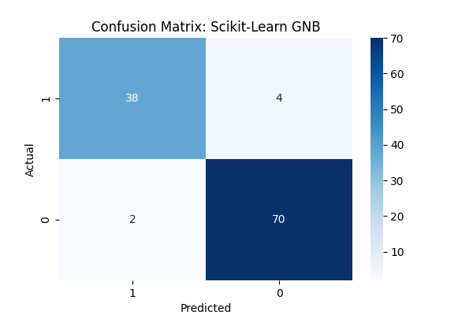

# Breast Cancer Classification: Native vs. Scikit-Learn

This project demonstrates the implementation of a **Gaussian Naive Bayes (GNB)** classifier. It compares a custom implementation built from scratch using NumPy against the industry-standard version from the Scikit-Learn library.

## 📊 Dataset
We use the **Breast Cancer Wisconsin (Diagnostic) Dataset**.
- **Source:** `sklearn.datasets.load_breast_cancer`
- **Samples:** 569
- **Features:** 30 (e.g., mean radius, texture, perimeter)
- **Target:** Binary (0: Malignant, 1: Benign)


## 🛠 Project Structure
The project compares two distinct approaches to classification:

### 1. Native Implementation (From Scratch)
A custom class that manually calculates:
- **Priors:** The probability of each class occurring.
- **Likelihood:** Uses the Gaussian Probability Density Function (PDF) to calculate how likely a feature value is given a class:
  $$P(x_i | y) = \frac{1}{\sqrt{2\pi\sigma_y^2}} \exp\left(-\frac{(x_i - \mu_y)^2}{2\sigma_y^2}\right)$$
- **Log-Space Math:** Implemented using natural logs to avoid "arithmetic underflow" (numbers becoming too small for the computer to handle).

### 2. Scikit-Learn Implementation
Uses the `sklearn.naive_bayes.GaussianNB` model as a benchmark for performance and accuracy.

### 📈 Performance Metrics Comparison

| Metric | Native (Manual) | Scikit-Learn |
| :--- | :--- | :--- |
| **Accuracy Score** | **0.9649** | 0.9474 |
| **Recall Score** | **0.9859** | 0.9722 |
| **Precision Score** | **0.9589** | 0.9459 |
| **F1 Score** | **0.9722** | 0.9589 |

### Visualizing the Results

| Native (Manual) | Scikit-Learn |
| :---: | :---: |
|  |  |

#### Understanding the Matrix:
- **Top-Left (40/38):** True Positives (Correctly identified Malignant).
- **Bottom-Right (70):** True Negatives (Correctly identified Benign).
- **Top-Right (3/4):** False Positives (Type I Error).
- **Bottom-Left (1/2):** False Negatives (Type II Error - **Most dangerous in medical cases!**).


## 🚀 Getting Started

### Prerequisites
- Python 3.12
- Libraries listed in `requirements.txt`

### Installation
```bash
pip install -r requirements.txt
